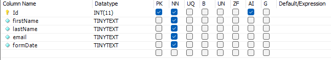

# A little bit about execution

This is simple form with backend, As I am Angular developer app is very simple, I spend something
around 3-4h making it and learning react, express and MySql.

There is a lot of thing than could be made better, for there should be components, API communication
should have shouldn't be in components but should have their services, CSS should be changes for SCSS and so on.

Even through it all it was fun experience, and I am thankfull for opportunity to learn React :)

# How to start up

You need you local server and Database with schema named <b>"form_management_system"</b> and table looking like that

then install all dependencies project needs, after that
in folder react-app-form use command <b>npm start</b>, to start up frontend
After that use <b>node ./index.js</b> in folder backend to start up backend

After those steps you can test app.

# Tests

I have never written tests, and I didn't do it here either, I know it is highly scored point,
but I think that I should learn every good practice there is from the beginning, and also
I don't have very much time right now to learn it as I would like to.